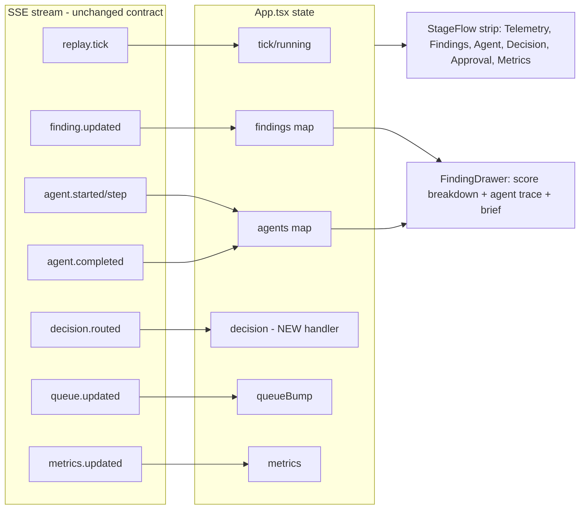

# feat: SOC demo end-to-end legibility

## Summary

The Tesco SOC console (`app/frontend`) streams a scripted 72-hour phishing storyline over SSE, but an audience cannot follow it. Findings are not clickable so the evidence and agent reasoning are invisible; the approval-queue panel sits empty for most of the run and reads as broken; two Director controls are dead or duplicated ("Skip to T-1" only writes a Lakebase field, "Fire agent" duplicates the AP1 override); and there is no visual of the pipeline stages the demo narrates. This plan makes the console legible end-to-end: a click-to-open finding **detail drawer**, a **stage-flow strip** that lights up as the storyline advances, an **early-seeded approval queue** with an "analyzing" placeholder, and **repaired Director controls** that actually drive the in-app simulator.

The scripted simulator (`app/backend/simulator.py`) stays the source of truth. All the data the drawer needs (score `components`, agent `brief_excerpt`, tier/confidence/groundedness) already streams over SSE and lands in `App` state — the work is mostly presentation plus small, targeted simulator/route changes for the two controls and the queue seeding.

---

## Problem Frame

**Who:** A presenter demoing the SOC console to a live audience (SEs, customers). The audience watches a projected screen and must grasp the autonomous-triage story without narration filling every gap.

**Current pain (from the code):**
- `TriageBoard.tsx:38` renders each finding as a static `
` — no click handler, no detail view exists anywhere. Score `components` stream in (`events.py:50`) and sit in `App` state (`App.tsx:41`) but are never shown. The audience sees a number climb with no explanation of *why*.
- `ApprovalQueue.tsx:42` shows "Nothing awaiting approval" until the hero agent fires at `AGENT_START_TICK` (tick 18, `simulator.py:63`) — roughly the back third of the run. For most of the demo the human-gate panel looks empty/broken.
- `DirectorConsole.tsx:63` "Skip to T-1" calls `api.replaySeek("T-1")` → `replay_control.seek` (`replay_control.py:52`) which only writes `sim_clock` to Lakebase. It does **not** touch the running `simulator` singleton, so nothing visible happens.
- `DirectorConsole.tsx:62` "Fire agent" calls `api.replayInject("AP1")` — byte-identical behavior to the AP1 override button two rows up. Redundant and confusing.
- There is no representation of the pipeline the demo describes (telemetry ingest → findings → agent tool loop → decision routing → human approval → metrics). The `decision.routed` SSE event is emitted by the simulator (`simulator.py:210`) and declared in the SSE client (`sse.ts:12`) but **never handled** in `App.tsx` — the routing stage is invisible.

**Outcome we want:** A presenter can press Run (or jump to a beat) and the audience can *see* each pipeline stage activate, click the hero finding to read its score breakdown and the agent's reasoning, and watch the item move into the human-approval gate — with no stage ever looking empty-because-broken.

---

## Requirements

- **R1.** Any finding on the Triage Board is clickable and opens a detail drawer showing: defanged domain, current risk score with band, per-component score breakdown, and (when the agent has run for that finding) the tool-loop steps, the recommended action + tier, agent confidence, and judge groundedness, and the full brief.
- **R2.** The drawer is driven by existing client SSE state (findings + agents already in `App`), shaped so a future real `/api/agent/traces` endpoint can back the trace section without a UI rewrite.
- **R3.** A stage-flow strip visualizes the six pipeline stages and reflects live progress: each stage shows idle / active / done from the SSE stream (telemetry ticking, findings climbing, agent running, decision routed, approval pending/resolved, metrics accumulating).
- **R4.** The approval-queue panel never reads as broken: before the hero agent completes, it shows an "agent analyzing the hero finding…" placeholder tied to agent progress; a pending item appears when the agent completes (current behavior) or earlier if seeded.
- **R5.** "Skip to T-1" is repaired to drive the simulator to the decision beat (agent-fires / approval-pending), OR removed. Chosen: repaired into a **"Jump to decision"** control that advances the running sim.
- **R6.** "Fire agent" redundancy is removed: one clearly-labeled control forces the hero agent now, distinct from the AP1 path-override.
- **R7.** No regression to the deterministic storyline, existing SSE contract, or `app/tests/test_simulator.py`. Event payload shapes in `events.py` are unchanged.

---

## Key Technical Decisions

**KTD1 — Drawer is client-state-first.** The drawer reads from the `findings` and `agents` maps already held in `App.tsx`. No new fetch on open. Rationale: every field the drawer needs already streams over SSE and is demo-safe/deterministic; wiring the stubbed `/api/agent/traces` endpoint (`main.py:147`, returns `{steps: []}`) would add backend work for no demo-visible gain. The drawer component takes a `Finding` + optional `AgentActivity` as props, so a later real-traces fetch can populate the same props without touching the drawer's render. (R2)

**KTD2 — Stage-flow strip derives state from existing SSE events, no new event types.** The strip computes each stage's status from data already in `App` (tick/running, findings count + max score, agent started/done, a newly-handled `decision.routed`, queue pending count, metrics totals). Rationale: keeps the SSE contract (`events.py`) frozen per R7; the only client gap is that `decision.routed` is declared but unhandled — add a handler in `App.tsx`. (R3, R7)

**KTD3 — "Jump to decision" is a new simulator method, not a Lakebase write.** Add `simulator.jump_to_decision()` that, if a run is active, fast-forwards the scripted tick counter to `AGENT_START_TICK` so the hero peaks and the agent fires on the next loop iteration; if no run is active, starts one at high speed already advanced to that tick. Replace the `/api/replay/seek` behavior for the demo control (keep the Lakebase mirror for the record). Rationale: makes the control do what its label promises against the actual visible sim. (R5)

**KTD4 — Approval placeholder is client-side, seeding is minimal.** The "analyzing" placeholder is pure frontend, derived from an in-flight hero `AgentActivity` (started, not done). Do **not** fabricate a fake pending queue item early — a real item still comes from the agent completing, preserving the human-gate causality the demo teaches. Rationale: satisfies R4 (never looks broken) without lying about the pipeline. (R4)

**KTD5 — Director control relabel over removal.** Keep two clearly-distinct beat controls: **"Jump to decision"** (KTD3) and drop the duplicate "Fire agent" in favor of the existing AP-override row already present, OR relabel one override as the explicit hero-force. Chosen: remove the standalone "Fire agent" button; the AP1 override already forces the hero. Add a short helper label so the override row reads as "inject / force path". (R6)

---

## High-Level Technical Design

Stage-flow strip: six stages, each a small pill that transitions idle → active → done, derived from live state. No new SSE events; `decision.routed` handler is the one client addition.

Stage → status derivation (all read-only over existing state):

| Stage | active when | done when |
|---|---|---|
| Telemetry | `tick >= 1 && running` | run completed (`running === false && tick > 0`) |
| Findings | any finding present, max score climbing | hero at peak (score ≥ 80) |
| Agent | a hero `AgentActivity` exists, `!done` | that activity `done` |
| Decision | `decision.routed` received | queue item exists |
| Approval | queue pending > 0 | queue item approved/rejected (via `queueBump` reload) |
| Metrics | `metrics.tokens > 0` | run completed |

---

## Implementation Units

### U1. Add `decision.routed` handler and decision state to App

**Goal:** Capture the already-emitted `decision.routed` event so the Decision stage and drawer can reflect routing. Currently declared in `sse.ts:12` but unhandled in `App.tsx`.

**Requirements:** R3, R7

**Dependencies:** none

**Files:**
- `app/frontend/src/App.tsx` (modify — add `decision` state + `"decision.routed"` handler in the `useSSE` map)

**Approach:** Add a `decision` state object (`{ decision_id, finding_id, route, tier, action } | null`). Add a `"decision.routed": setDecision` handler alongside the existing ones (`App.tsx:59-78`). Pass `decision` down to the new StageFlow strip (U4). No payload shape change.

**Patterns to follow:** the existing handler entries in the `useSSE({...})` call (`App.tsx:63-77`).

**Test scenarios:**
- Happy path: a `decision.routed` frame updates `decision` state with the routed action/tier.
- Edge: no `decision.routed` yet → `decision` is `null`, Decision stage renders idle (verified via U4 tests).
- `Test expectation: light` — App is a wiring shell; the substantive assertions live in U4/U2 component tests. Add one render test asserting the handler is registered if a test harness for `App` exists; otherwise cover via StageFlow.

---

### U2. FindingDrawer component (score breakdown + agent trace + brief)

**Goal:** A slide-over/modal drawer showing full finding detail, opened by clicking a Triage Board row. Implements R1/R2.

**Requirements:** R1, R2

**Dependencies:** none (consumes existing `Finding` + `AgentActivity` types from `App.tsx`)

**Files:**
- `app/frontend/src/components/FindingDrawer.tsx` (new)
- `app/frontend/src/components/FindingDrawer.test.tsx` (new — if a component test runner is present; see Verification)

**Approach:** Props: `{ finding: Finding; agent?: AgentActivity; onClose: () => void }`. Render:
1. Header — defanged domain (`defang` from `lib.ts`), `RiskMeter` (reuse `ui.tsx:54`), band label from `riskColor` thresholds.
2. **Score breakdown** — iterate `finding.components` (e.g. `{brand_similarity: 90, users: 17, credential_entry: 1, privileged: 1}`) as labeled rows with small proportional bars. Map component keys to human labels (brand similarity, affected users, credential entry seen, privileged account, recency, repeat access, report-only).
3. **Agent trace** — when `agent` present: the tool-loop steps (reuse the `TOOL_LABEL` map — extract it to a shared module so both `TriageBoard` and the drawer use it), then when `agent.done`: recommended action + tier badge, confidence %, groundedness %, and the full brief text (`agent.brief_excerpt`).
4. Overlay + `Esc`/backdrop-click to close, focus-trap not required for demo.

Styling: reuse CSS vars (`--bg-panel`, `--border`, plane colors) and the `Panel`/`Badge` primitives. Slide-over from the right, `position: fixed`, backdrop dimmed.

**Patterns to follow:** `Panel`/`Badge`/`RiskMeter` in `ui.tsx`; the inline agent-step rendering in `TriageBoard.tsx:50-61` (move `TOOL_LABEL` to `lib.ts` or a new `agentLabels.ts` and import in both).

**Test scenarios:**
- Happy: given a finding with `components`, renders one labeled row per component with the score value.
- Happy: given a `done` agent, renders recommended action, tier, confidence %, groundedness %, and brief text.
- Edge: finding with no agent → trace section shows nothing (or "no agent run yet"), no crash.
- Edge: agent present but `!done` → shows in-progress step markers, no action/brief block.
- Interaction: backdrop click and `Esc` both call `onClose`.
- Edge: empty `components` object → breakdown section renders empty without error.

---

### U3. Make Triage Board rows clickable → open drawer

**Goal:** Wire row clicks to open `FindingDrawer` for the clicked finding. Implements R1 interaction.

**Requirements:** R1

**Dependencies:** U2

**Files:**
- `app/frontend/src/views/TriageBoard.tsx` (modify — add selection state + click handler + render drawer)
- `app/frontend/src/lib.ts` or `app/frontend/src/agentLabels.ts` (modify/new — shared `TOOL_LABEL`)

**Approach:** Add `selectedId` state in `TriageBoard` (or lift to `App` if cleaner — prefer local to keep `App` lean). On row click, set `selectedId = f.finding_id`. Render `<FindingDrawer>` when a finding is selected, passing that finding and its `agentByFinding[selectedId]`. Add `cursor: pointer`, hover affordance (border/background shift on `:hover` via inline handlers or a class), and `role="button"` + keyboard `onKeyDown` Enter/Space for accessibility. Keep the existing inline step markers on the row (they read well at a glance); the drawer is the deep view.

**Patterns to follow:** existing row render (`TriageBoard.tsx:34-64`); `agentByFinding` map already computed at `TriageBoard.tsx:24`.

**Test scenarios:**
- Happy: clicking a row opens the drawer with that finding's data.
- Happy: clicking the hero row shows the agent trace in the drawer.
- Interaction: closing the drawer returns to the board with no finding selected.
- Edge: clicking a non-hero row (no agent) opens drawer without a trace section.
- A11y: Enter key on a focused row opens the drawer.

---

### U4. StageFlow strip component

**Goal:** A horizontal six-stage pipeline strip that lights up idle → active → done from live state. Implements R3.

**Requirements:** R3

**Dependencies:** U1 (needs `decision` state)

**Files:**
- `app/frontend/src/components/StageFlow.tsx` (new)
- `app/frontend/src/components/StageFlow.test.tsx` (new — if runner present)
- `app/frontend/src/App.tsx` (modify — render StageFlow, pass derived props)

**Approach:** Props: `{ tick, running, findings, agents, decision, queuePending, metrics }` (or a pre-derived `stages` array computed in `App`). Render six pills (Telemetry, Findings, Agent, Decision, Approval, Metrics) left→right with connector chevrons. Each pill: label + status dot; color/opacity by status using plane vars (`--data` for telemetry/metrics, `--ai` for agent/decision, `--human` for approval/findings-gate). Status derivation per the HTD table. Place the strip in the `App` grid between the Director Console and the board (new grid row, or inside the director area).

**Patterns to follow:** `Badge` styling in `ui.tsx`; the grid layout in `App.tsx:80-87` (add a grid area).

**Test scenarios:**
- Happy: with `running && tick>0` and no findings, Telemetry=active, all later stages=idle.
- Happy: hero at score 82 + agent done + decision routed + 1 pending → Findings/Agent/Decision=done, Approval=active.
- Edge: run completed (`running=false, tick>0`) → Telemetry & Metrics=done.
- Edge: all-zero initial state → all six idle, no crash.
- Progression: Agent flips active when a hero `AgentActivity` exists and `!done`, done when `done`.

---

### U5. Approval-queue "analyzing" placeholder

**Goal:** The approval panel shows an "agent analyzing the hero finding…" state while the hero agent is in-flight, so it never reads as empty-broken. Implements R4.

**Requirements:** R4

**Dependencies:** none (reads agent activity)

**Files:**
- `app/frontend/src/views/ApprovalQueue.tsx` (modify — accept in-flight agent signal, render placeholder)
- `app/frontend/src/App.tsx` (modify — pass a `heroAnalyzing` boolean or the hero `AgentActivity` to `ApprovalQueue`)

**Approach:** `ApprovalQueue` currently only knows `bump` and fetches the queue. Pass a prop derived in `App`: `analyzing = some hero agent exists && !done && pending.length === 0`. When `analyzing`, replace the "Nothing awaiting approval" empty text with a placeholder card: spinner/pulse + "Agent analyzing tesco-clubcard-support[.]com — recommendation pending review". When a real pending item arrives (existing flow), it renders as today. Do not fabricate a queue item (KTD4).

**Patterns to follow:** the empty-state block `ApprovalQueue.tsx:42-44`; badge/card styling in the pending map.

**Test scenarios:**
- Happy: hero agent in-flight, no pending items → placeholder card shown, not the bare empty text.
- Happy: pending item present → placeholder hidden, item rendered (current behavior preserved).
- Edge: no agent running, no pending → original "Nothing awaiting approval" text.
- Edge: agent done + item pending → no placeholder, real item only.

---

### U6. Repair "Skip to T-1" → "Jump to decision" (simulator + route + control)

**Goal:** Make the beat-jump control actually advance the running simulator to the decision beat. Implements R5, R6.

**Requirements:** R5, R6, R7

**Dependencies:** none (backend), coordinates with U4 for the resulting stage transitions

**Files:**
- `app/backend/simulator.py` (modify — add `jump_to_decision()`)
- `app/backend/main.py` (modify — `/api/replay/seek` or a new `/api/replay/jump` drives the simulator)
- `app/frontend/src/views/DirectorConsole.tsx` (modify — relabel control, remove duplicate "Fire agent")
- `app/frontend/src/lib.ts` (modify — add `replayJump` if a new route, or keep `replaySeek`)
- `app/tests/test_simulator.py` (modify — cover the jump)

**Approach:**
- `simulator.py`: add `async def jump_to_decision(self, speed=720.0)`. If `self.running`, set the loop's tick cursor forward so the next iteration is `>= AGENT_START_TICK` (the run loop reads `self.tick`; introduce a `self._skip_to` the loop honors at the top of each iteration, or restart the run pre-advanced). Simplest safe approach: if not running, `await self.start(speed)` then set a `_jump_target = AGENT_START_TICK` that `_run` fast-forwards to by emitting intermediate findings without sleeping until the target tick. Keep emissions monotonic so the board fills correctly.
- `main.py`: point the demo control at the simulator. Prefer a new `POST /api/replay/jump` that calls `await simulator.jump_to_decision()` and still mirrors `sim_clock` via `replay_control.seek` for the record. Leave `/api/replay/seek` intact for the Lakebase-only path if referenced elsewhere.
- `DirectorConsole.tsx`: rename "Skip to T-1" → "Jump to decision"; remove the standalone "Fire agent" button (`:62`) — the AP1 override already forces the hero. Add a faint helper label on the override row ("override / force path").
- `lib.ts`: add `replayJump: () => req("/api/replay/jump", { method: "POST" })`.

**Execution note:** Add the simulator test first (`test_simulator.py`) asserting that after a jump the agent-fires path is reached and findings are non-empty, then implement `jump_to_decision`.

**Patterns to follow:** `simulator.start`/`_run` lifecycle (`simulator.py:102-192`); route style in `main.py:66-92`; `replay_control.seek` mirror (`replay_control.py:52`).

**Test scenarios:**
- Happy: `jump_to_decision` on a fresh sim starts a run and reaches `AGENT_START_TICK` so the hero agent fires (assert `QUEUE_UPDATED`/`AGENT_COMPLETED` emitted).
- Happy: `jump_to_decision` on an already-running sim advances to the decision beat without leaving an orphan task (respects the lifecycle lock).
- Edge: findings emitted before the jump target are still present (board not left empty).
- Regression: existing `test_simulator.py` cases (normal run, inject) still pass — event shapes unchanged.
- Route: `POST /api/replay/jump` returns 200 and triggers the simulator (contract test if API tests exist).

---

## Scope Boundaries

**In scope:** finding detail drawer, stage-flow strip, approval placeholder, repaired/deduped Director controls, the one missing `decision.routed` client handler.

**Deferred to Follow-Up Work:**
- Wiring `/api/agent/traces` to serve a real MLflow trace (drawer is shaped to accept it — KTD1).
- Persisting stage state to Lakebase for reconnect fidelity.
- Seeding a genuinely earlier queue item from a second (non-hero) finding if the demo wants two approval beats.

**Outside this effort's identity:** rebuilding on real streaming/Lakebase data (scripted sim stays truth), auth/OBO changes, new attack storylines, mobile/responsive layout.

---

## System-Wide Impact

- **SSE contract (`events.py`):** unchanged. Only a client-side handler for the already-emitted `decision.routed` is added.
- **Simulator determinism:** the jump adds a fast-forward path; the default Run storyline and its baked scores/curves are untouched. `test_simulator.py` guards this.
- **Grid layout (`App.tsx`):** one new row/area for the StageFlow strip; board/queue/metrics areas unchanged.
- **Backend routes:** one new `POST /api/replay/jump`; `/api/replay/seek` left intact.

---

## Risks & Dependencies

- **R-risk1 — jump fast-forward leaves the board sparse or races the lifecycle lock.** Mitigation: fast-forward by emitting intermediate `finding.updated` frames up to the target tick before resuming normal cadence; route the jump through the same `_lifecycle_lock` as `start`/`stop` (`simulator.py:82`). Covered by U6 tests.
- **R-risk2 — drawer + inline steps duplicate the `TOOL_LABEL` map and drift.** Mitigation: extract `TOOL_LABEL` to a shared module (U3) and import in both `TriageBoard` and `FindingDrawer`.
- **R-risk3 — StageFlow "done" thresholds hard-coded (score ≥ 80) diverge from the baked hero peak (82).** Mitigation: derive the peak from the finding data (max observed score) rather than a magic constant, or centralize the threshold next to `riskColor`.
- **Dependency:** U3 depends on U2; U4 depends on U1. U5 and U6 are independent and can land in parallel.

---

## Verification

- **Frontend:** `cd app/frontend && npm run build` (and `npm test` if a runner is configured — check `app/frontend/package.json`; if none, component `.test.tsx` files are aspirational and the units fall back to manual visual verification via the running app).
- **Backend:** `cd app && python -m pytest tests/test_simulator.py -q` passes, including new jump cases.
- **End-to-end visual:** run the app, press Run — confirm stages light up in order, click the hero finding to see the breakdown + brief, confirm the approval panel shows the analyzing placeholder then the pending item, confirm "Jump to decision" advances straight to the agent-fires beat, confirm no duplicate "Fire agent" button remains.
