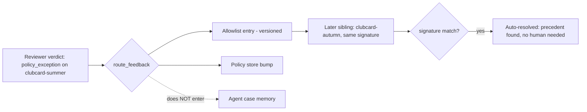

# feat: SOC console tabs — Executive Overview (dashboard + Genie) and Feedback Loop

## Summary

The SOC console is a single situation board. This plan turns it into a tabbed app with a top navigation bar and three views:

1. **Live Triage** — the existing situation board (Director Console, StageFlow, Triage Board, Approval Queue, Metrics), unchanged in behavior.
2. **Executive Overview** — a leadership dashboard (headline KPIs, campaign rollup, risk distribution, auto-vs-human split) plus an embedded **Genie Q&A** panel for natural-language questions over the SOC datasets, mirroring the telco-tower "Executive Overview" pattern.
3. **Feedback Loop** — a visualization of the learning loop that already exists in the backend but is invisible in the UI: a reviewer's reason-coded verdict routes to destinations (eval dataset / case memory / allowlist / policy store), and a **later sibling signal of the same type auto-resolves** because the router finds the recorded precedent. This is the clubcard-summer → clubcard-autumn Act-4 beat, made visible end-to-end.

The backend feedback machinery is real and tested (`agents/eval/reason_codes.py` routing table, `agents/eval/feedback_processor.py`, `agents/tools/search_case_memory.py` signature match). Genie has only an env placeholder (`SOC_GENIE_SPACE_ID` in `app/app.yaml`) and no API wiring. This plan adds the tab shell, the two new views, the small backend endpoints they need (a feedback-routing preview, a case-memory read, and a Genie proxy with a deterministic demo fallback), and deploys.

**Target repo:** auto-threat-intelligence-tesco-demo (this repo). Deploys to Databricks app `tesco-soc` on profile `fe-vm-lakebase-praneeth` (see project memory for the redeploy recipe).

---

## Problem Frame

**Who:** The same presenter demoing to a Tesco security-eng + leadership audience. Leadership wants the "so what" (campaign-level rollup, ask-a-question), and the security engineers want to see that the system *learns* — that a human correction changes how the next similar signal is handled without a human in the loop.

**Current pain:**
- One flat view. No way to switch between the operator's live board and a leadership summary. The telco-tower demo had an Executive Overview tab (dashboard + Genie) that landed well with leadership; this demo has no equivalent.
- The **feedback loop is invisible.** The backend routes reason-coded verdicts to case memory / allowlist / policy store, and `search_case_memory` matches a sibling domain by signature so the next similar finding auto-closes — but nothing in the UI shows this. The single most important "it learns" story is buried in Python. Reviewers approve/reject and see nothing about what the correction *taught* the system or how a future similar signal is handled.
- **Genie is referenced but not wired.** `SOC_GENIE_SPACE_ID` sits in `app.yaml` env with no endpoint calling it.

**Outcome we want:** A nav bar with three tabs. Executive Overview gives leadership KPIs + a working "ask a question over the data" box. Feedback Loop shows, for a chosen reason code, exactly where the correction is written and then demonstrates a sibling signal of the same type auto-resolving against that precedent — the compound-learning beat, on screen.

---

## Requirements

- **R1.** A top navigation bar lets the user switch between three tabs — **Live Triage**, **Executive Overview**, **Feedback Loop** — without a full reload. The active tab is visually marked. The SSE connection and live state persist across tab switches (findings/agents/metrics keep streaming while on another tab).
- **R2.** Live Triage renders the existing board exactly as today (no behavior regression to Director Console, StageFlow, Triage, Approval, Metrics).
- **R3.** Executive Overview shows leadership KPIs derived from live state/metrics: total events, anomalies, auto-resolved vs human-queued split, escalation rate, agreement rate, tokens/cost. Plus a campaign rollup (findings grouped by campaign/hero with max risk) and a risk-band distribution.
- **R4.** Executive Overview embeds a **Genie Q&A** panel: a text box + ask button; questions post to a backend Genie proxy; the answer (and any returned tabular result / SQL) renders in the panel. In-workspace it calls the Databricks Genie Conversation API for `SOC_GENIE_SPACE_ID`; locally/without a space id it returns a **deterministic scripted answer** over the demo dataset (same offline-safe pattern as the simulator) so the demo always works.
- **R5.** Feedback Loop visualizes the routing: given a reason code (the four exact codes), show the destinations it fans out to (eval dataset / case memory / allowlist / policy store) and whether it enters agent case memory. This reads the real routing table, not a hardcoded copy.
- **R6.** Feedback Loop demonstrates the **post-feedback behavior for a similar signal**: after a `policy_exception` on the clubcard-summer domain routes to the allowlist, triggering a sibling (clubcard-autumn) shows it **auto-resolving** because the router finds the precedent by signature — rendered as a before/after or a stepped flow. The signature match uses the real `finding_signature` logic.
- **R7.** No regression to the SSE contract, the simulator storyline, or existing tests. New backend endpoints are additive.
- **R8.** Ships: build passes, backend tests pass (including new endpoint tests), deployed to the `tesco-soc` Databricks app, verified live per the deploy memory (logs + workspace export marker; SSO blocks headless UI).

---

## Key Technical Decisions

**KTD1 — Client-side tab routing, shared live state lifted to App.** The `useSSE` subscription and all live state (findings, agents, decision, metrics, tick) stay in `App`; tabs are a local `activeTab` state that swaps which view renders. Rationale: R1 requires the stream to persist across tab switches — if a tab unmounted the SSE hook, switching away and back would drop the run. No router library; a single `activeTab` union type keeps it minimal. The three views become presentational, fed by props from App.

**KTD2 — Genie proxy endpoint with deterministic fallback.** Add `POST /api/genie/ask` that, when `SOC_GENIE_SPACE_ID` is set, calls the Databricks Genie Conversation API via the SDK (`WorkspaceClient`, already a dependency, pinned ≥0.120.0 per deploy memory); when unset (local/demo), returns a scripted answer keyed by matching the question against a small canned set over the demo dataset. Rationale: mirrors the simulator's "deterministic script so the demo is offline-safe" principle; the SSO wall + no guaranteed Genie space at demo time make a hard live dependency fragile. The frontend cannot tell the difference — same response shape. **Deferred-to-implementation:** exact Genie SDK method/verbs (start conversation, poll message, fetch attachment) resolved against the installed SDK version during execution.

**KTD3 — Feedback Loop reads the real routing + signature logic via new read endpoints.** Add `GET /api/feedback/routing/{reason_code}` (returns `route_feedback` output — destinations + enters_case_memory) and `POST /api/feedback/simulate-sibling` (given the recorded precedent, returns whether a sibling signature matches and would auto-resolve). Rationale: R5/R6 must reflect the actual `reason_codes.py` table and `finding_signature`, not a UI copy that can drift. These wrap existing pure functions — cheap and deterministic.

**KTD4 — Feedback Loop demo is scripted over the real functions, no live DB writes.** The sibling auto-close demonstration calls the routing/signature functions with the scripted clubcard-summer/autumn values (already the storyline's Act-4 data) and renders the result; it does not require a live Lakebase case_memory write. Rationale: demo-safe and deterministic; the real DB path is exercised by existing backend tests, and the UI's job is to *show* the loop, not to be the integration test.

**KTD5 — Nav bar owns tab state + the Director Console stays global.** The Director Console (Run/Pause/speed/jump) sits above the tabs and is always visible, because the presenter drives the storyline from any tab and the Executive/Feedback views react to the same run. Rationale: the run is the demo's clock; hiding its controls behind a tab would break the narration flow. Nav bar and Director Console share the top region.

---

## High-Level Technical Design

Tab shell: App holds SSE + live state and `activeTab`; NavBar switches tabs; Director Console is global; the active view renders below.

```mermaid
flowchart TB
  subgraph App[App.tsx — owns SSE + all live state + activeTab]
    SSE[useSSE: findings, agents, decision, metrics, tick]
    TAB[activeTab: live | executive | feedback]
  end
  App --> Director[DirectorConsole - global, always visible]
  App --> Nav[NavBar - Live Triage | Executive Overview | Feedback Loop]
  Nav -->|sets activeTab| TAB
  TAB -->|live| Live[Live Triage view: StageFlow + Board + Queue + Metrics]
  TAB -->|executive| Exec[Executive Overview: KPIs + campaign rollup + risk dist + Genie panel]
  TAB -->|feedback| FB[Feedback Loop: routing map + sibling auto-close demo]
  Exec -->|POST /api/genie/ask| GenieAPI[Genie proxy: live SDK or scripted fallback]
  FB -->|GET /api/feedback/routing/:code| RouteAPI[route_feedback]
  FB -->|POST /api/feedback/simulate-sibling| SibAPI[finding_signature match]
```

Feedback Loop — the on-screen learning beat (reads real routing table):



Reason-code → destination table the Feedback Loop view renders (from `reason_codes.py`, not copied):

| Reason code | Destinations | Enters case memory |
|---|---|---|
| wrong_classification | eval dataset, case memory | yes |
| insufficient_evidence | eval dataset | no |
| wrong_action | eval dataset, policy review | no |
| policy_exception | allowlist, policy store | no |

---

## Output Structure

```
app/frontend/src/
  App.tsx                      (modify — lift state, add activeTab, render NavBar + Director + active view)
  components/
    NavBar.tsx                 (new — three-tab top nav)
  views/
    LiveTriage.tsx             (new — extracts the current board grid into one view)
    ExecutiveOverview.tsx      (new — KPIs + campaign rollup + risk dist + Genie panel)
    GeniePanel.tsx             (new — ask box + answer/table render)
    FeedbackLoop.tsx           (new — routing map + sibling auto-close demo)
  lib.ts                       (modify — add genieAsk, feedbackRouting, simulateSibling)
app/backend/
  main.py                      (modify — add /api/genie/ask, /api/feedback/routing/{code}, /api/feedback/simulate-sibling)
  genie.py                     (new — Genie proxy: live SDK path + scripted fallback)
app/tests/
  test_genie_and_feedback_api.py  (new — endpoint contract tests)
```

---

## Implementation Units

### U1. NavBar + tab shell (lift state to App)

**Goal:** A top nav bar with three tabs; App owns `activeTab` and keeps the SSE subscription + live state mounted across switches. Director Console stays global above the tabs.

**Requirements:** R1, R2, KTD1, KTD5

**Dependencies:** none (but U2 extracts the Live view it renders)

**Files:**
- `app/frontend/src/components/NavBar.tsx` (new)
- `app/frontend/src/App.tsx` (modify)

**Approach:** Add `type Tab = "live" | "executive" | "feedback"` and `activeTab` state (default `"live"`). NavBar renders three buttons styled as tabs (active = plane-accent underline/border, per theme tokens), calls `onSelect(tab)`. App layout becomes: Director Console (global) → NavBar → the active view. Keep `useSSE` and all state in App so nothing unmounts. Pass live state down to whichever view is active. Reduced-motion respected (theme already handles it).

**Patterns to follow:** `Badge`/`Button` styling and plane colors in `components/ui.tsx`; the existing grid in `App.tsx`.

**Test scenarios:**
- Happy: clicking each tab swaps the rendered view; active tab is marked.
- Persistence: switching to Executive and back to Live does not reset findings/agents (state lives in App). Verify via a render test or manual browser check.
- A11y: tabs are keyboard-focusable, `role="tab"`/`aria-selected` set.
- Edge: default tab is Live Triage on first load.
- `Test expectation: light` — presentational shell; substantive assertions are the persistence check + manual verification.

---

### U2. Extract Live Triage view

**Goal:** Move the current board grid (StageFlow + Triage Board + Approval Queue + Metrics) into a `LiveTriage` view component fed by props, leaving App as the state owner. No behavior change.

**Requirements:** R2

**Dependencies:** U1

**Files:**
- `app/frontend/src/views/LiveTriage.tsx` (new)
- `app/frontend/src/App.tsx` (modify — render `<LiveTriage .../>` when `activeTab === "live"`)

**Approach:** Cut the board/queue/metrics/stage grid out of App's return into `LiveTriage`, passing `findings, agents, decision, metrics, tick, queuePending, analyzing, onPending` as props. App keeps owning the state and handlers. Pure refactor — the DOM output for the Live tab is identical to today.

**Patterns to follow:** current `App.tsx` grid and prop wiring from the prior plan.

**Test scenarios:**
- Regression: Live tab renders identical structure to pre-refactor (findings list, queue, metrics, stage strip present).
- Edge: empty state (no run started) shows the same "press Run" prompt.
- `Test expectation: none — pure extraction; covered by existing manual/visual verification and the R2 regression check.`

---

### U3. Backend: feedback routing + sibling read endpoints

**Goal:** Expose the real routing table and signature-match logic to the UI. Implements R5/R6 data path.

**Requirements:** R5, R6, R7, KTD3, KTD4

**Dependencies:** none

**Files:**
- `app/backend/main.py` (modify — two endpoints)
- `app/tests/test_genie_and_feedback_api.py` (new — shared with U5 tests)

**Approach:**
- `GET /api/feedback/routing/{reason_code}` → call `route_feedback(reason_code)` from `agents.eval.reason_codes`; return `{reason_code, destinations, enters_case_memory}`. Invalid code → 422 with the allowed list.
- `POST /api/feedback/simulate-sibling` with body `{campaign_id, recommended_action, precedent_reason_code}` → build the precedent signature and a sibling signature via `finding_signature` (`agents.tools.search_case_memory`); return `{signature, matches: bool, would_auto_resolve: bool, precedent: {...}}`. For the demo default (clubcard family), `matches` is true so the sibling auto-resolves.

**Execution note:** Add the endpoint contract tests first, then wire the routes.

**Patterns to follow:** route style in `main.py` (`/api/replay/*`), the pure functions in `agents/eval/reason_codes.py` and `agents/tools/search_case_memory.py`.

**Test scenarios:**
- Happy: `GET /api/feedback/routing/policy_exception` → destinations `[allowlist, policy_store]`, `enters_case_memory: false`.
- Happy: `GET /api/feedback/routing/wrong_classification` → includes `case_memory`, `enters_case_memory: true`.
- Error: `GET /api/feedback/routing/bogus` → 422, body lists valid codes.
- Happy: `POST /api/feedback/simulate-sibling` with the clubcard family → `would_auto_resolve: true`, signature matches precedent.
- Edge: sibling with a different campaign/action → `matches: false`, `would_auto_resolve: false`.

---

### U4. Backend: Genie proxy with deterministic fallback

**Goal:** `POST /api/genie/ask` returns an answer over the SOC data — live Genie in-workspace, scripted answer locally. Implements R4 data path.

**Requirements:** R4, R7, KTD2

**Dependencies:** none

**Files:**
- `app/backend/genie.py` (new)
- `app/backend/main.py` (modify — mount the route)
- `app/tests/test_genie_and_feedback_api.py` (shared test file)

**Approach:** `genie.py` exposes `async def ask(question: str) -> dict`. If `os.environ.get("SOC_GENIE_SPACE_ID")`: use `WorkspaceClient` to start/continue a Genie conversation for that space, poll the message to completion, and return `{answer, sql, rows, source: "genie"}` (exact SDK verbs resolved at execution against the pinned SDK; wrap in try/except so any failure degrades to the fallback rather than 500). Else: match the question (lowercased keyword contains) against a small canned map over the demo dataset — e.g. "top campaign" / "how many anomalies" / "hero" / "auto-resolved" — and return `{answer, source: "scripted", rows?}`. Always return a stable shape. Route: `POST /api/genie/ask` body `{question}` → `genie.ask`.

**Execution note:** Implement the scripted fallback first (deterministic, testable offline); gate the live SDK path behind the env check so tests never touch the network.

**Patterns to follow:** env-gated behavior in `main.py:_default_repo` (Lakebase vs Fake); SDK usage pattern in `replay_control.py` (`WorkspaceClient` import inside the function).

**Test scenarios:**
- Happy (offline): `POST /api/genie/ask {"question":"what's the top campaign?"}` with no `SOC_GENIE_SPACE_ID` → `source: "scripted"`, non-empty answer mentioning FreshCart PhishOps.
- Happy (offline): a "how many anomalies" question → scripted answer with the count.
- Edge: unrecognized question → a graceful default scripted answer, still 200 + stable shape.
- Resilience: live path exception is caught and degrades to scripted (simulate by monkeypatching the SDK call to raise).
- Shape: response always has `answer` and `source` keys.

---

### U5. Executive Overview view + Genie panel

**Goal:** Leadership dashboard (KPIs + campaign rollup + risk distribution) with an embedded Genie Q&A panel. Implements R3/R4 UI.

**Requirements:** R3, R4

**Dependencies:** U1, U4

**Files:**
- `app/frontend/src/views/ExecutiveOverview.tsx` (new)
- `app/frontend/src/components/GeniePanel.tsx` (new)
- `app/frontend/src/lib.ts` (modify — `genieAsk`)

**Approach:**
- **KPIs:** big stat tiles from live `metrics` + derived counts (events, anomalies, auto-resolved, human-queued, escalation %, agreement %, tokens). Reuse the `Stat` visual language from `MetricsStrip`.
- **Campaign rollup:** group `findings` by campaign (all five are FreshCart PhishOps; group by hero vs tail) showing count + max risk + status mix. A simple table/bar.
- **Risk distribution:** count findings per risk band (crit/high/mid/low via `riskColor` thresholds) as a small bar row.
- **Genie panel (`GeniePanel.tsx`):** controlled input + Ask button; on submit calls `api.genieAsk(question)`, shows a loading state, renders `answer` prose and, if `rows` present, a compact table; shows a small `source` badge (genie vs scripted) so the demo is honest about the path. Suggested-question chips ("top campaign?", "how many anomalies?") to make the demo one-click.
- `lib.ts`: `genieAsk: (q) => req("/api/genie/ask", {method:"POST", body: JSON.stringify({question: q})})`.

**Patterns to follow:** `MetricsStrip.tsx` Stat component; `Panel`/`Badge` in `ui.tsx`; `defang` for any indicator rendering; the dataviz skill's stat-tile/bar guidance for the KPI + distribution visuals.

**Test scenarios:**
- Happy: KPIs render from a metrics object; zero-state shows `0`/`·` without crash.
- Happy: campaign rollup groups the five findings and shows max risk per group.
- Happy: Genie ask → answer renders; a `rows` payload renders a table; `source` badge shown.
- Edge: Genie ask with empty input is a no-op (button disabled).
- Edge: Genie request failure shows an inline error, not a blank panel.
- Interaction: clicking a suggested-question chip fills + submits.

---

### U6. Feedback Loop view

**Goal:** Visualize the reason-code routing and the post-feedback sibling auto-close beat. Implements R5/R6 UI.

**Requirements:** R5, R6

**Dependencies:** U1, U3

**Files:**
- `app/frontend/src/views/FeedbackLoop.tsx` (new)
- `app/frontend/src/lib.ts` (modify — `feedbackRouting`, `simulateSibling`)

**Approach:** Two stacked sections.
1. **Routing map:** a reason-code selector (the four codes). On select, call `api.feedbackRouting(code)` and render the destinations as labeled nodes (eval / case memory / allowlist / policy store) with an explicit "enters agent case memory: yes/no" callout. Highlight the teaching insight for `policy_exception` (goes to allowlist, NOT case memory — so the agent is not taught to under-escalate).
2. **Post-feedback behavior (the compound beat):** a stepped flow — (a) reviewer rejects clubcard-summer with `policy_exception` → writes allowlist entry; (b) a sibling clubcard-autumn arrives with the same signature; (c) call `api.simulateSibling(...)` → render the result: **auto-resolved, precedent found, no human needed**. Show the matched signature. Use a before/after or numbered-step layout with the plane-accent colors (human → data). Wire an optional "trigger sibling" button to `api.replayInject("clubcard-autumn")` so the presenter can also see it hit the live board on the Live tab.
- `lib.ts`: `feedbackRouting: (code) => req(/api/feedback/routing/${code})`; `simulateSibling: (body) => req("/api/feedback/simulate-sibling", {method:"POST", body: JSON.stringify(body)})`.

**Patterns to follow:** `StageFlow.tsx` for stepped/pill visuals; `Panel`/`Badge`; `defang` for domain rendering.

**Test scenarios:**
- Happy: selecting `policy_exception` shows allowlist + policy store, "enters case memory: no", with the teaching callout.
- Happy: selecting `wrong_classification` shows eval + case memory, "enters case memory: yes".
- Happy: the sibling step calls the endpoint and renders "auto-resolved / precedent found".
- Edge: before a reason code is selected, the routing map shows a neutral prompt.
- Interaction: "trigger sibling" posts the inject and gives visible feedback.
- A11y: reason-code selector is keyboard-usable.

---

### U7. Ship — build, test, deploy, verify

**Goal:** Ship the tabbed console to the `tesco-soc` Databricks app and verify live. Implements R8.

**Requirements:** R7, R8

**Dependencies:** U1–U6

**Files:** none (build + deploy)

**Approach:** Follow the deploy recipe in project memory: `npm run build` the frontend; run backend tests (`.venv/bin/pytest app/tests -q`); stage a clean dir (drop `.venv`, `node_modules`, `tests`, `src/`, keep `dist/`); `rm -rf` the stage's `dist/` before re-sync to avoid stale bundles; `databricks workspace import-dir` to `/Workspace/Users/praneeth.paikray@databricks.com/apps/tesco-soc`; `databricks apps deploy tesco-soc --source-code-path <WS>`. Verify: `databricks apps logs tesco-soc` shows "Application startup complete"; `workspace export` the deployed `main.py`/bundle and grep for a marker (a new route path) to confirm latest code is live; check `active_deployment.update_time`. SSO wall blocks headless UI — verify via logs + export, not curl. Optionally set `SOC_GENIE_SPACE_ID` in `app.yaml` env if a Genie space is available; otherwise the scripted fallback serves the demo.

**Execution note:** Run the local end-to-end (uvicorn + browser) before deploy, as in the prior unit, to confirm all three tabs work against the live simulator.

**Test scenarios:**
- Build passes (`tsc -b && vite build`).
- Backend suite green including new endpoint tests.
- Deploy returns SUCCEEDED and logs show startup complete.
- Export marker confirms the new `/api/genie/ask` route is in the deployed bundle.
- `Test expectation: none — deploy/verify unit; evidence is build output, test run, deploy logs, and export grep.`

---

## Scope Boundaries

**In scope:** nav bar + three tabs, Executive Overview (KPIs + campaign rollup + risk dist + Genie panel), Genie proxy with scripted fallback, Feedback Loop view over the real routing/signature logic, the small read endpoints they need, deploy.

**Deferred to Follow-Up Work:**
- Live Genie result charting beyond a simple table (viz of returned rows).
- Persisting Feedback Loop demonstrations to Lakebase case_memory from the UI (the real write path already exists and is tested; the UI only visualizes).
- A real second (non-hero) queue item to give the Feedback Loop a live human-reject to route.
- Wiring `/api/agent/traces` to real MLflow (carried from the prior plan).

**Outside this effort's identity:** replacing the scripted simulator with live streaming data, auth/OBO changes, new attack storylines, mobile/responsive layout, a routing library.

---

## Risk Analysis & Mitigation

- **R-risk1 — Lifting state to App for tabs regresses the Live board.** The prior plan wired findings/agents/decision/analyzing/queuePending in App. Mitigation: U2 is a pure extraction; keep the exact prop wiring, verify the Live tab renders identically (R2 regression scenario) before touching other tabs.
- **R-risk2 — Genie live SDK path breaks the demo or 500s.** Mitigation (KTD2): env-gate the live path, wrap in try/except that degrades to the scripted fallback, and default the demo to scripted. Tests never touch the network.
- **R-risk3 — Feedback Loop routing copy drifts from `reason_codes.py`.** Mitigation (KTD3): the view fetches `route_feedback` output from the backend rather than hardcoding the table; the HTD table in this plan is documentation, not the source of truth.
- **R-risk4 — SSE stream drops on tab switch.** Mitigation (KTD1): `useSSE` lives in App and never unmounts; only child views swap. Explicit persistence test scenario in U1.
- **R-risk5 — Deploy ships stale JS bundle.** Mitigation (deploy memory): `rm -rf` stage `dist/` before re-sync; verify live via export marker + `active_deployment.update_time`, not just SUCCEEDED.

**Dependencies:** U1 → U2/U5/U6 (all need the shell). U5 needs U4 (Genie endpoint). U6 needs U3 (feedback endpoints). U3 and U4 are independent and can land first/in parallel. U7 last.

---

## System-Wide Impact

- **SSE contract (`events.py`):** unchanged. Tabs consume existing client state.
- **Backend routes:** three new additive read/proxy endpoints; no change to existing routes or repository interface.
- **Simulator:** untouched; Feedback Loop optionally reuses the existing `replayInject("clubcard-autumn")` override.
- **Deploy:** same `tesco-soc` app; new `genie.py` module and endpoints included in the bundle; optional `SOC_GENIE_SPACE_ID` env.
- **Frontend structure:** App becomes the state owner + shell; the four board components move under a `LiveTriage` view unchanged.

---

## Verification

- **Frontend:** `cd app/frontend && npm run build`.
- **Backend:** `.venv/bin/pytest app/tests -q` (all green incl. new endpoint tests).
- **Local end-to-end:** uvicorn + browser — switch all three tabs; confirm the stream keeps running across switches; press Run and watch Executive KPIs update; ask a Genie question and see a scripted answer; open Feedback Loop, select `policy_exception`, run the sibling step and see auto-resolve.
- **Live deploy:** logs show "Application startup complete"; `workspace export` confirms the `/api/genie/ask` route is present; `active_deployment.update_time` is fresh.
- **Independent review:** run `/codex review` once Codex auth is available (blocked this session — `codex login` needed); otherwise an adversarial reviewer subagent pass before merge.
